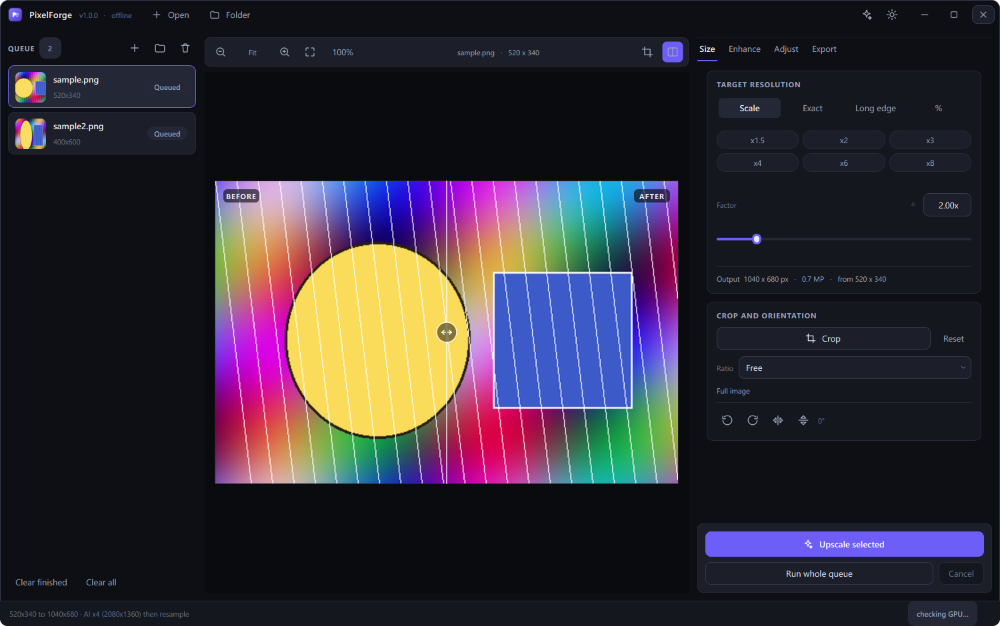
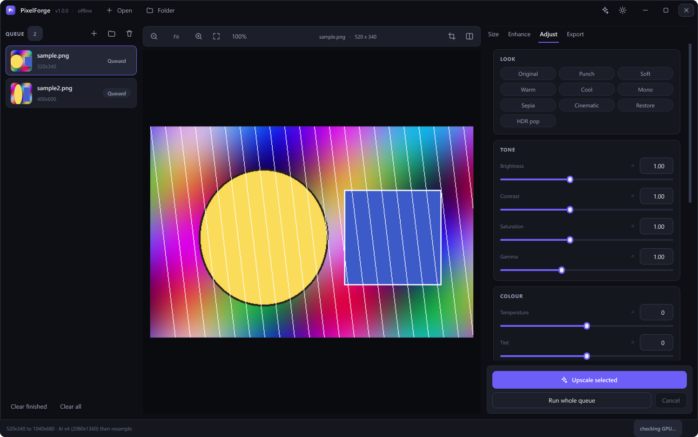

# PixelForge

Offline AI image upscaler, editor and batch converter. Neural super-resolution
runs locally on your GPU — no account, no upload, no network call after the
one-time model download.


---

## What it does

- **AI upscaling** with Real-ESRGAN (ncnn/Vulkan). Works on NVIDIA, AMD and
  Intel GPUs, and falls back to CPU.
- **Any output size.** Pick a factor (x2, x4, …), an exact resolution
  (1200x720), a long-edge target, or a preset (Full HD, 2K, 4K, 8K, A4 at
  300 dpi, Instagram, story, wallpaper).
- **Live before/after** comparison with a draggable split handle, zoom and pan.
- **Crop** with aspect-ratio lock, rule-of-thirds guides and pixel readout,
  plus rotate and flip.
- **Filters and adjustments**: brightness, contrast, saturation, gamma,
  temperature, tint, sharpness, unsharp mask, denoise, blur, vignette, mono,
  sepia, invert, auto-contrast, equalize — with one-click looks.
- **Convert** to PNG, JPEG, WebP, TIFF, BMP, ICO, AVIF and HEIC, with quality,
  compression and metadata control.
- **Batch queue**: drop a folder in, run everything, watch per-file progress.
- **Non-destructive**: your settings describe an edit; the source file is never
  touched.
- **CLI** for scripting, sharing the exact same pipeline as the GUI.

| Compare | Adjust | Light theme |
| --- | --- | --- |
|  |  |  |

---

## Install

Requires **Python 3.10 or newer**.

```bash
git clone https://github.com/your-org/pixelforge.git
```

```bash
cd pixelforge && pip install -r requirements.txt
```

Then fetch the Real-ESRGAN runtime once (~45 MB — it is not committed to the
repository):

```bash
python scripts/fetch_models.py
```

Launch:

```bash
python run.py
```

Or install it as a package and use the `pixelforge` entry point:

```bash
pip install -e .
```

---

## How the sizing works

The AI models only know fixed integer factors (x2 / x3 / x4), but you want
arbitrary sizes. PixelForge always does this:

1. Work out the exact target box from your settings.
2. Run the **smallest** chain of AI passes that reaches or exceeds that box.
3. Resample down to the exact box with Lanczos.

Downscaling a super-resolved image is what keeps arbitrary targets sharp. Going
the other way — AI-upscale then stretch up — would just blur.

So `400x600 → 1200x720` with the x4plus model becomes: AI x4 to 1600x2400, then
Lanczos to 1200x720. The status bar shows the plan before you commit to it.

### Fit modes

When you ask for an exact size that does not match the source aspect ratio:

| Mode | Result |
| --- | --- |
| **Cover** | Fills the box, crops the overflow. Default. |
| **Contain** | Fits inside the box, keeps aspect. Output may be smaller than asked. |
| **Pad** | Fits inside, letterboxes to the exact box with your background colour. |
| **Stretch** | Exact box, distorts the aspect ratio. |

---

## Models

| Model | Best for | Factors |
| --- | --- | --- |
| `realesrgan-x4plus` | Photos, general images. Handles JPEG noise. **Default.** | x4 |
| `realesrgan-x4plus-anime` | Illustrations, anime, flat colour art. | x4 |
| `realesr-animevideov3` | Fast anime model, lowest VRAM. | x2, x3, x4 |
| `classic` | No AI. Lanczos, bicubic, bilinear, hamming, box, nearest. | any |

Pick `x4plus-anime` for drawings — it sharpens line art far better, and ruins
photographs. Pick `classic` when you only want a clean downscale or a
pixel-art-safe nearest-neighbour blow-up.

---

## Command line

```bash
python -m pixelforge --cli photos/ -o out/ --preset uhd --format WEBP -q 90
```

```bash
python -m pixelforge --cli portrait.jpg --size 1200x720 --fit cover --look restore
```

```bash
python -m pixelforge --cli --list-devices
```

Useful flags: `--scale`, `--size WxH`, `--preset`, `--long-edge`, `--fit`,
`--crop X,Y,W,H`, `--rotate`, `--model`, `--cpu`, `--tile`, `--look`,
`--sharpen`, `--denoise`, `--format`, `--quality`, `--dry-run`.

---

## Keyboard shortcuts

| Keys | Action |
| --- | --- |
| `Ctrl+O` / `Ctrl+Shift+O` | Add images / add a folder |
| `Ctrl+Enter` | Upscale the selected image |
| `Ctrl+Shift+Enter` | Run the whole queue |
| `C` | Crop tool |
| `B` | Before/after split |
| `Ctrl+0` / `Ctrl+1` | Fit to window / zoom to 100% |
| `Ctrl+±` | Zoom in / out |
| `Delete` | Remove the selected file from the queue |
| `Ctrl+Shift+T` | Toggle light / dark theme |
| `Esc` | Leave crop mode, or cancel a run |
| `F11` | Maximize |

Double-click a finished queue entry to reveal the output file.

---

## Limits — worth knowing before you file a bug

- **No infinite detail.** Real-ESRGAN reconstructs plausible texture; it does
  not recover information that was never captured. Past roughly 4x–8x, results
  smear. 400x600 to 8K will not look like an 8K photo.
- **Text and logos** are the weak spot. The model hallucinates letterforms.
  Re-render vector sources instead of upscaling them.
- **Heavy motion blur and out-of-focus shots** stay blurry. Super-resolution is
  not deblurring.
- **CPU mode is slow.** Minutes per image at 4K. Use a Vulkan GPU if you can.
- **VRAM.** If a large image fails, lower the tile size in the Enhance tab
  (Auto → 256 → 128).
- **Memory guard.** Outputs are capped at ~120 megapixels and 32768 px per
  edge; requests beyond that are scaled back proportionally.
- **HEIC and AVIF** need optional wheels (`pillow-heif`, and Pillow ≥ 11.3 or
  `pillow-avif-plugin`). Unavailable formats are greyed out in the Export tab.
- **No face restoration yet** (GFPGAN). Tracked as a wishlist item.

---

## Project layout

```
pixelforge/
├── core/              headless pipeline — no Qt below this line
│   ├── geometry.py    target-size and AI-factor maths
│   ├── pipeline.py    crop → rotate → AI → fit → adjust → export
│   ├── adjust.py      tone and colour operations
│   ├── imageio.py     load, save, formats, metadata
│   └── backends/      classic (Pillow) and realesrgan (ncnn subprocess)
├── gui/               PySide6 layer
│   ├── theme.py       colour tokens and the stylesheet
│   ├── workers.py     background threads
│   └── widgets/       canvas, queue, inspector, title bar
└── cli.py             headless batch interface
```

The core has no Qt import anywhere, which is why the CLI and the test suite run
without a display.

---

## Development

```bash
pip install -e ".[dev,formats]"
```

```bash
pytest -m "not slow" -q
```

```bash
ruff check .
```

`-m "not slow"` skips the tests that need a Vulkan GPU. Run the full suite
locally once you have fetched the models.

---

## Licence

MIT — see [LICENSE](LICENSE).

Real-ESRGAN and ncnn are BSD 3-Clause and are downloaded at install time, not
redistributed here. Credit to [Xintao Wang and
contributors](https://github.com/xinntao/Real-ESRGAN) for the models.
