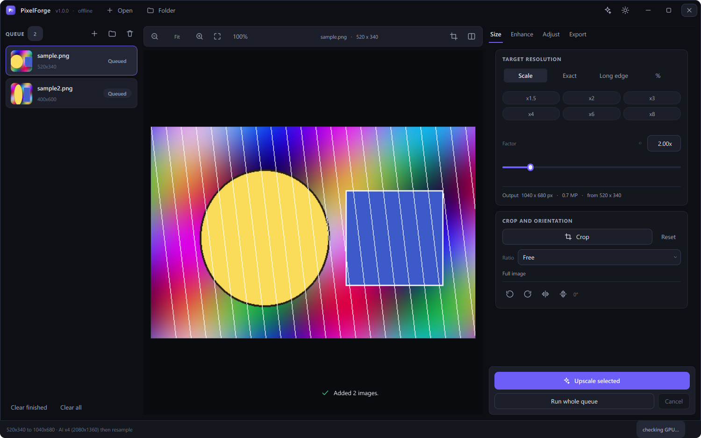
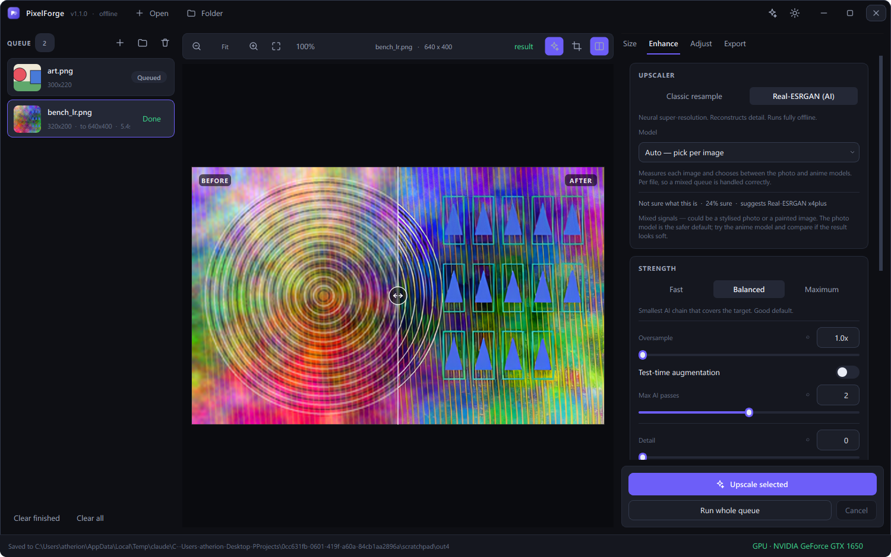
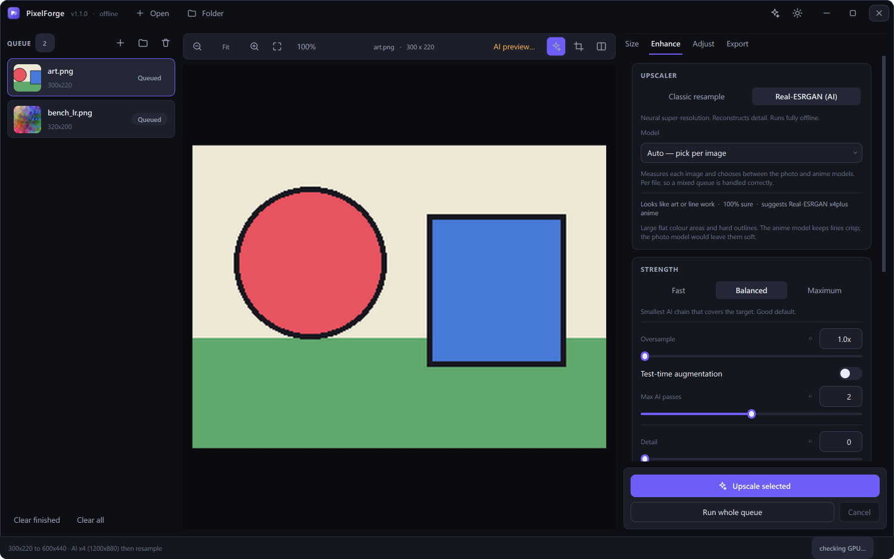
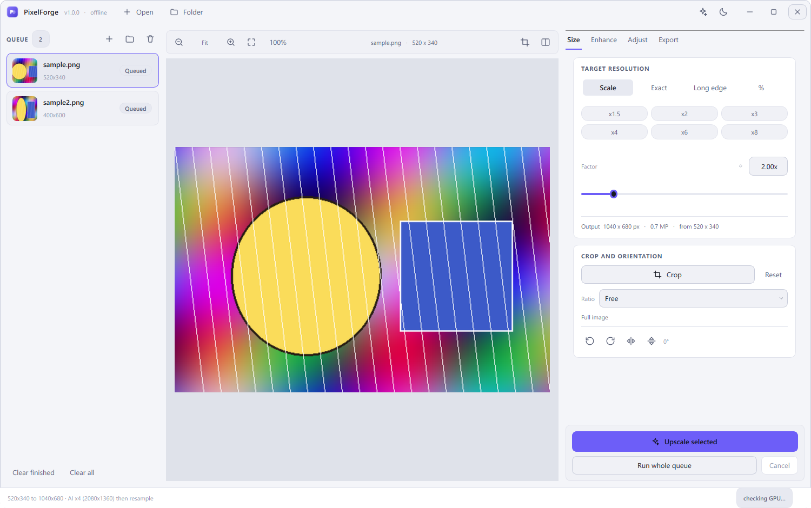
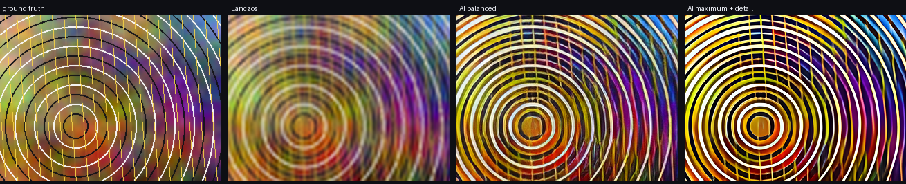

# PixelForge

Offline AI image upscaler, editor and batch converter. Neural super-resolution
runs locally on your GPU — no account, no upload, no network call after the
one-time model download.



---

## What it does

- **AI upscaling** with Real-ESRGAN (ncnn/Vulkan). Works on NVIDIA, AMD and
  Intel GPUs, and falls back to CPU.
- **Picks the model for you.** Measures each image, tells photographs from
  illustrations, and routes to the right weights — per file, with the reasoning
  shown and a one-click override.
- **Any output size.** Pick a factor (x2, x4, …), an exact resolution
  (1200x720), a long-edge target, or a preset (Full HD, 2K, 4K, 8K, A4 at
  300 dpi, Instagram, story, wallpaper).
- **Live before/after** comparison with a draggable split handle, zoom and pan.
  The "after" side runs the **real model** on a small proxy, so what you compare
  is the actual result and not a Lanczos stand-in.
- **Strength controls**: Fast / Balanced / Maximum, plus supersampling, test-time
  augmentation, pass chaining, and detail/clarity recovery.
- **Crop** with aspect-ratio lock, rule-of-thirds guides and pixel readout,
  plus rotate and flip.
- **Filters and adjustments**: brightness, contrast, saturation, gamma,
  temperature, tint, sharpness, unsharp mask, denoise, blur, vignette, mono,
  sepia, invert, auto-contrast, equalize — with one-click looks.
- **Convert** to PNG, JPEG, WebP, TIFF, BMP, ICO, AVIF and HEIC, with quality,
  compression and metadata control.
- **Batch queue**: drop a folder in, run everything, watch per-file progress.
- **Non-destructive**: your settings describe an edit; the source file is never
  touched.
- **CLI** for scripting, sharing the exact same pipeline as the GUI.

| Result comparison | Automatic model choice | Light theme |
| --- | --- | --- |
|  |  |  |

---

## Install

Requires **Python 3.10 or newer**.

```bash
git clone https://github.com/your-org/pixelforge.git
```

```bash
cd pixelforge && pip install -r requirements.txt
```

Then fetch the Real-ESRGAN runtime once (~45 MB — it is not committed to the
repository):

```bash
python scripts/fetch_models.py
```

Launch:

```bash
python run.py
```

Or install it as a package and use the `pixelforge` entry point:

```bash
pip install -e .
```

---

## How the sizing works

The AI models only know fixed integer factors (x2 / x3 / x4), but you want
arbitrary sizes. PixelForge always does this:

1. Work out the exact target box from your settings.
2. Run the **smallest** chain of AI passes that reaches or exceeds that box.
3. Resample down to the exact box with Lanczos.

Downscaling a super-resolved image is what keeps arbitrary targets sharp. Going
the other way — AI-upscale then stretch up — would just blur.

So `400x600 → 1200x720` with the x4plus model becomes: AI x4 to 1600x2400, then
Lanczos to 1200x720. The status bar shows the plan before you commit to it.

### Fit modes

When you ask for an exact size that does not match the source aspect ratio:

| Mode | Result |
| --- | --- |
| **Cover** | Fills the box, crops the overflow. Default. |
| **Contain** | Fits inside the box, keeps aspect. Output may be smaller than asked. |
| **Pad** | Fits inside, letterboxes to the exact box with your background colour. |
| **Stretch** | Exact box, distorts the aspect ratio. |

---

## Strength — how hard to push

Results land in `Pictures/upscaled` by default. Change it on the Export tab, or
switch on "Save next to the original".

| Preset | Passes | Oversample | TTA | Cost |
| --- | --- | --- | --- | --- |
| **Fast** | 1 | 1x | off | baseline |
| **Balanced** | up to 2 | 1x | off | baseline |
| **Maximum** | up to 3 | 2x | on | ~30x slower |

- **Oversample** renders above the target and resamples back down. That is
  supersampling: it averages out the model's per-pixel guesses, so edges come
  back cleaner. It costs a whole extra AI pass.
- **Test-time augmentation** runs the model over eight flips and rotations and
  averages the results. Roughly 8x slower on its own.
- **Detail** is multi-scale micro-contrast applied after the upscale — it splits
  the image into a fine and a mid band and lifts each, which recovers texture
  without the halo a single big unsharp mask leaves.
- **Clarity** is large-radius local contrast, masked out of highlights and
  shadows so it adds punch without crushing anything.

### Does it actually do anything?

Ground truth 1280x800, shrunk to 320x200, upscaled back. Measured on a
GTX 1650:

| Config | Time | PSNR | Sharpness | HF energy |
| --- | --- | --- | --- | --- |
| _ground truth_ | — | — | 4780 | 47.4 |
| Lanczos only | 0.0s | **19.17** | 32 | 5.8 |
| AI balanced | 5.5s | 15.97 | 2055 | 66.2 |
| AI balanced + detail 50 | 5.3s | 14.53 | 3626 | 98.8 |
| AI maximum | 180s | 14.99 | 3944 | 94.3 |
| AI maximum + detail + clarity | 163s | 12.95 | 7624 | 146.8 |



**Read that table carefully.** Lanczos wins on PSNR and loses badly to the eye.
PSNR rewards a safe blurry average and punishes invented detail even when the
invention is plausible — this is a known and well-documented property of
GAN-based super-resolution, not a quirk of this build. Sharpness (variance of
the Laplacian) tracks what you actually see: Lanczos reconstructs 32 against the
ground truth's 4780, while AI balanced reaches 2055.

Note also that "AI maximum + detail + clarity" overshoots the ground truth's
sharpness by 1.6x. That is over-sharpening, not accuracy. Maximum is worth it
for small or soft sources; for a decent photo, Balanced with detail around 30
is usually the better-looking result and 30x faster.

---

## Models

| Model | Best for | Factors |
| --- | --- | --- |
| **`auto`** | **Measures each image and picks between the two below. Default.** | x4 |
| `realesrgan-x4plus` | Photos, general images. Handles JPEG noise. | x4 |
| `realesrgan-x4plus-anime` | Illustrations, anime, flat colour art. | x4 |
| `realesr-animevideov3` | Fast anime model, lowest VRAM. | x2, x3, x4 |
| `classic` | No AI. Lanczos, bicubic, bilinear, hamming, box, nearest. | any |

Choosing between the photo and anime weights is the single highest-impact
decision, and they fail in opposite directions: the photo model leaves line art
mushy, the anime model turns skin and foliage into plastic.

**Auto** measures it instead of guessing. On a 256 px proxy it scores three
signals — how much of the frame is flat colour, how many distinct colours are
in use, and how dense the hard edges are — and routes accordingly. The Enhance
tab shows the verdict, the confidence, and why, for every image you select. It
runs per file, so a mixed queue is handled correctly.

Override it any time from the same dropdown; when your choice differs from the
recommendation, a one-click "Switch to …" button appears.

Pick `classic` when you only want a clean downscale or a pixel-art-safe
nearest-neighbour blow-up.

---

## Comparing the result

When a render finishes, the canvas switches to the finished image with the
before/after slider already up. The "before" side is your source scaled to the
same size with Lanczos — the honest baseline, at matching dimensions, so the
handle compares like with like.

Results stay cached per file: select another image and come back, and the
comparison is still there. Change any setting and the view returns to the live
preview, because the cached render no longer reflects what you asked for.

---

## Command line

```bash
python -m pixelforge --cli photos/ -o out/ --preset uhd --format WEBP -q 90
```

```bash
python -m pixelforge --cli portrait.jpg --size 1200x720 --fit cover --look restore
```

```bash
python -m pixelforge --cli --list-devices
```

```bash
python -m pixelforge --cli old-scan.png --scale 4 --quality maximum --detail 40
```

Output goes to `Pictures/upscaled` unless you pass `-o` or `--next-to-source`.

Useful flags: `--scale`, `--size WxH`, `--preset`, `--long-edge`, `--fit`,
`--crop X,Y,W,H`, `--rotate`, `--model`, `--cpu`, `--tile`, `--look`,
`--quality fast|balanced|maximum`, `--oversample`, `--tta`, `--max-chain`,
`--detail`, `--clarity`, `--sharpen`, `--denoise`, `--format`, `--dry-run`.

---

## Keyboard shortcuts

| Keys | Action |
| --- | --- |
| `Ctrl+O` / `Ctrl+Shift+O` | Add images / add a folder |
| `Ctrl+Enter` | Upscale the selected image |
| `Ctrl+Shift+Enter` | Run the whole queue |
| `C` | Crop tool |
| `B` | Before/after split |
| `A` | AI preview on/off |
| `Ctrl+0` / `Ctrl+1` | Fit to window / zoom to 100% |
| `Ctrl+±` | Zoom in / out |
| `Delete` | Remove the selected file from the queue |
| `Ctrl+Shift+T` | Toggle light / dark theme |
| `Esc` | Leave crop mode, or cancel a run |
| `F11` | Maximize |

Double-click a finished queue entry to reveal the output file.

---

## Limits — worth knowing before you file a bug

- **No infinite detail.** Real-ESRGAN reconstructs plausible texture; it does
  not recover information that was never captured. Past roughly 4x–8x, results
  smear. 400x600 to 8K will not look like an 8K photo.
- **The AI preview is a proxy.** The source is capped to 520 px on its long edge
  before the preview pass, so it is representative, not pixel-identical to the
  full-size render. The final output always runs on the real source.
- **Maximum is genuinely slow.** ~30x Balanced. On a big source it can mean
  minutes per image. It also stacks more passes, and passes compound their own
  artefacts — more is not automatically better.
- **Text and logos** are the weak spot. The model hallucinates letterforms.
  Re-render vector sources instead of upscaling them.
- **Heavy motion blur and out-of-focus shots** stay blurry. Super-resolution is
  not deblurring.
- **CPU mode is slow.** Minutes per image at 4K. Use a Vulkan GPU if you can.
- **VRAM.** If a large image fails, lower the tile size in the Enhance tab
  (Auto → 256 → 128).
- **Memory guard.** Outputs are capped at ~120 megapixels and 32768 px per
  edge; requests beyond that are scaled back proportionally.
- **HEIC and AVIF** need optional wheels (`pillow-heif`, and Pillow ≥ 11.3 or
  `pillow-avif-plugin`). Unavailable formats are greyed out in the Export tab.
- **No face restoration yet** (GFPGAN). Tracked as a wishlist item.

---

## Project layout

```
pixelforge/
├── core/              headless pipeline — no Qt below this line
│   ├── geometry.py    target-size and AI-factor maths
│   ├── pipeline.py    crop → rotate → AI → fit → adjust → export
│   ├── adjust.py      tone and colour operations
│   ├── imageio.py     load, save, formats, metadata
│   └── backends/      classic (Pillow) and realesrgan (ncnn subprocess)
├── gui/               PySide6 layer
│   ├── theme.py       colour tokens and the stylesheet
│   ├── workers.py     background threads
│   └── widgets/       canvas, queue, inspector, title bar
└── cli.py             headless batch interface
```

The core has no Qt import anywhere, which is why the CLI and the test suite run
without a display.

---

## Development

```bash
pip install -e ".[dev,formats]"
```

```bash
pytest -m "not slow" -q
```

```bash
ruff check .
```

`-m "not slow"` skips the tests that need a Vulkan GPU. Run the full suite
locally once you have fetched the models.

---

## Licence

MIT — see [LICENSE](LICENSE).

Real-ESRGAN and ncnn are BSD 3-Clause and are downloaded at install time, not
redistributed here. Credit to [Xintao Wang and
contributors](https://github.com/xinntao/Real-ESRGAN) for the models.
